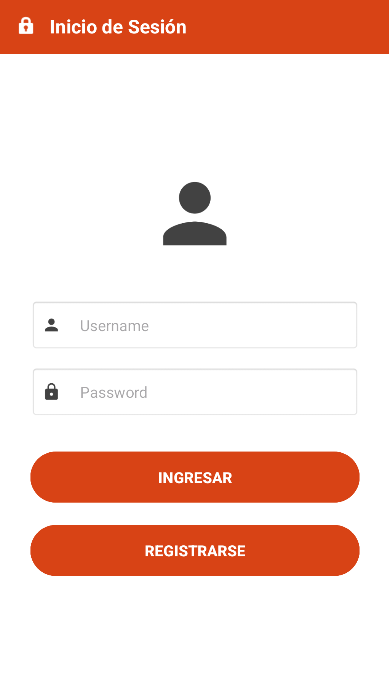
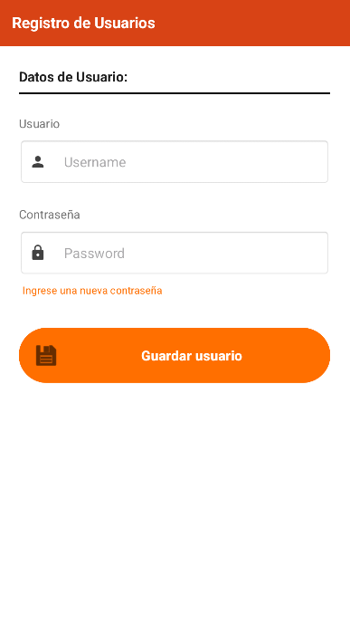
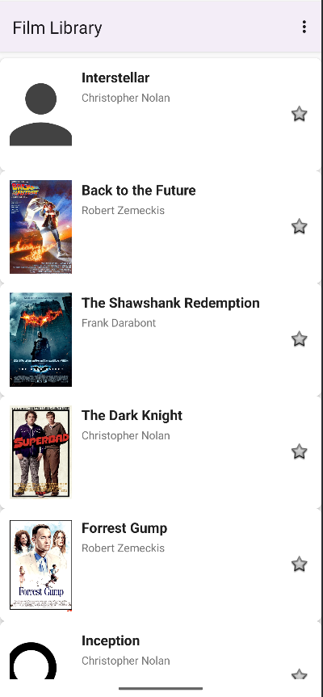
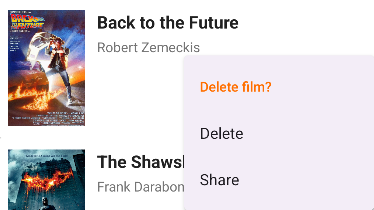
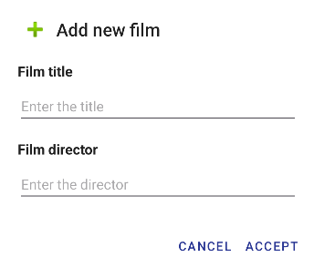
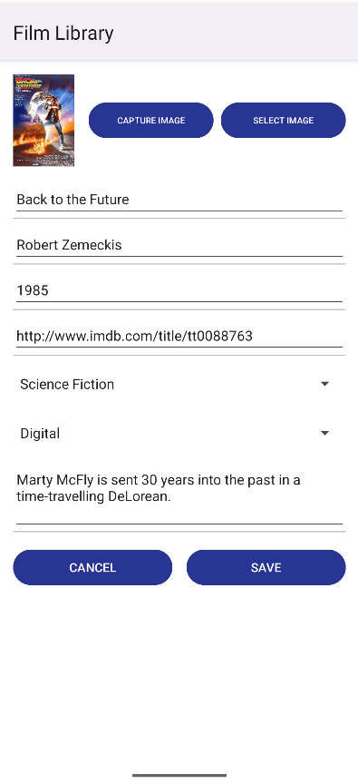
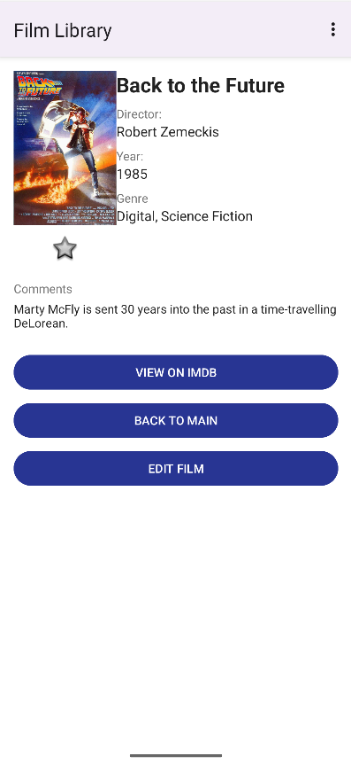
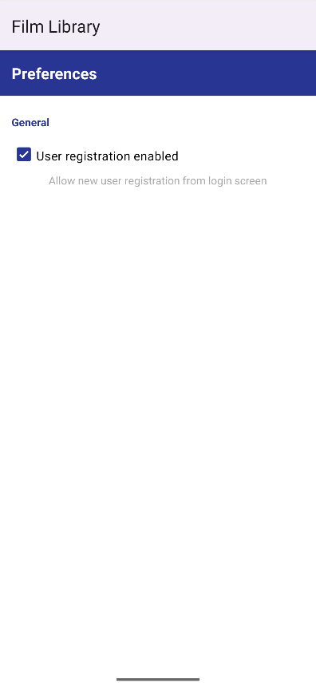
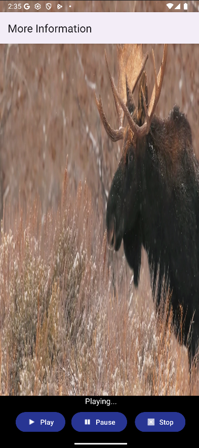

# 🎬 Filmoteca - Gestor de Películas

<div align="center">


**Una aplicación Android completa para gestionar tu colección personal de películas**

[Características](#-características) • [Instalación](#-instalación) • [Uso](#-uso) • [Arquitectura](#-arquitectura) • [Capturas](#-capturas-de-pantalla)

</div>

---

## 📋 Descripción

**Filmoteca** es una aplicación Android nativa desarrollada en Java que permite a los usuarios gestionar su colección personal de películas de forma intuitiva y completa. La aplicación implementa las mejores prácticas de desarrollo Android, incluyendo persistencia de datos con SQLite, gestión de preferencias, navegación entre actividades y reproducción multimedia.

---

## ✨ Características

### 🎯 Gestión de Películas
- ✅ **Añadir películas** con información completa (título, director, año, formato, género, comentarios)
- ✅ **Editar películas** existentes con formulario prellenado
- ✅ **Eliminar películas** con confirmación
- ✅ **Marcar como favoritas** para acceso rápido
- ✅ **Vista detallada** con toda la información de cada película

### 🗄️ Base de Datos SQLite
- ✅ Persistencia completa de datos
- ✅ 15 películas precargadas como ejemplo
- ✅ Operaciones CRUD completas (Create, Read, Update, Delete)
- ✅ Uso de `Cursor` para consultas eficientes
- ✅ DatabaseHelper siguiendo buenas prácticas

### 🔐 Sistema de Autenticación
- ✅ Pantalla de login como LAUNCHER
- ✅ Sistema de registro de usuarios
- ✅ Validación de credenciales
- ✅ Almacenamiento seguro de usuarios en BD
- ✅ **Recordar último usuario** con SharedPreferences

### ⚙️ Preferencias y Ajustes
- ✅ Pantalla de ajustes personalizada
- ✅ Guardar preferencias del usuario
- ✅ Opción para habilitar/deshabilitar registro
- ✅ Persistencia de configuración entre sesiones

### 🎨 Interfaz de Usuario
- ✅ **ListView personalizado** con adapter custom
- ✅ **Spinner** para selección de formatos y géneros
- ✅ **Menú ActionBar** con múltiples opciones
- ✅ **Menú Contextual** (clic largo) para editar/eliminar
- ✅ **Toast personalizados** con iconos y colores
- ✅ **AlertDialogs** para confirmaciones
- ✅ Iconos personalizados para mejor UX

### 🎥 Multimedia
- ✅ **Reproducción de video** con MediaPlayer
- ✅ Controles de reproducción (Play, Pause, Stop)
- ✅ Video local integrado en la app
- ✅ Pantalla "Más info" con contenido multimedia

### 📱 Navegación
- ✅ **Paso de datos entre Activities** (Parcelable/Serializable)
- ✅ **Activity Result API** para edición de películas
- ✅ Transiciones fluidas entre pantallas
- ✅ Back navigation correctamente implementado

### 🔔 Notificaciones
- ✅ Notificaciones locales con canales (Android 8+)
- ✅ Gestión de permisos (Android 13+)
- ✅ NotificationCompat para retrocompatibilidad

---

## 🛠️ Tecnologías Utilizadas

| Categoría | Tecnología |
|-----------|-----------|
| **Lenguaje** | Java 8+ |
| **SDK Mínimo** | Android 7.0 (API 24) |
| **SDK Target** | Android 13+ (API 33) |
| **Base de Datos** | SQLite 3 |
| **Persistencia** | SharedPreferences |
| **UI Components** | Material Components |
| **Multimedia** | MediaPlayer API |
| **Build System** | Gradle |

---

## 📦 Instalación

### Prerequisitos
- Android Studio Hedgehog | 2023.1.1 o superior
- JDK 11 o superior
- Dispositivo Android o Emulador con API 24+

### Pasos de Instalación

1. **Clonar el repositorio**
```bash
git clone https://github.com/ruubeenn13/filmoteca-RubenJuan.git
cd filmoteca-RubenJuan
```

2. **Abrir en Android Studio**
   - Abre Android Studio
   - Selecciona "Open an Existing Project"
   - Navega hasta la carpeta del proyecto

3. **Sincronizar Gradle**
   - Espera a que Gradle sincronice automáticamente
   - Si hay errores, haz click en "Sync Project with Gradle Files"

4. **Ejecutar la aplicación**
   - Conecta un dispositivo Android o inicia un emulador
   - Click en el botón "Run" (▶️) o presiona `Shift + F10`

---

## 🎮 Uso

### 1️⃣ Login
Al iniciar la app por primera vez:
- **Registrar usuario**: Crea una cuenta nueva
- **Iniciar sesión**: Accede con credenciales existentes
- Usuario por defecto: `admin` / `admin`

### 2️⃣ Pantalla Principal
- **Lista de películas**: Visualiza tu colección completa
- **Click en película**: Ver detalles completos
- **Click largo en película**: Menú contextual (Editar/Eliminar)
- **FAB (+)**: Añadir nueva película

### 3️⃣ Añadir/Editar Película
Completa el formulario con:
- Título
- Director
- Año de lanzamiento
- Formato (DVD, Blu-ray, Digital, VHS)
- Género (Acción, Comedia, Drama, Ciencia Ficción, Terror)
- Comentarios personales
- Marcar como favorita

### 4️⃣ Menú de Opciones
- **Acerca de**: Información de la aplicación
- **Añadir película**: Formulario de nueva película
- **Ajustes**: Preferencias de la aplicación
- **Más info**: Contenido multimedia

---

## 🏗️ Arquitectura

### Estructura del Proyecto

```
filmoteca-RubenJuan/
│
├── app/
│   ├── src/
│   │   ├── main/
│   │   │   ├── java/es/pmdm/filmoteca/
│   │   │   │   ├── Film.java                    # Modelo de datos (Parcelable)
│   │   │   │   ├── FilmDataSource.java          # Singleton para gestión de datos
│   │   │   │   ├── DatabaseHelper.java          # SQLiteOpenHelper
│   │   │   │   ├── FilmListActivity.java        # Activity principal
│   │   │   │   ├── FilmDataActivity.java        # Detalles de película
│   │   │   │   ├── FilmEditActivity.java        # Añadir/Editar película
│   │   │   │   ├── LoginActivity.java           # Pantalla de login
│   │   │   │   ├── AboutActivity.java           # Acerca de
│   │   │   │   ├── SettingsActivity.java        # Ajustes
│   │   │   │   ├── MoreActivity.java            # Multimedia
│   │   │   │   └── CustomToast.java             # Toast personalizado
│   │   │   │
│   │   │   ├── res/
│   │   │   │   ├── layout/                      # Layouts XML
│   │   │   │   ├── drawable/                    # Imágenes y recursos
│   │   │   │   ├── menu/                        # Menús XML
│   │   │   │   ├── raw/                         # Video multimedia
│   │   │   │   ├── values/                      # Strings, colores, estilos
│   │   │   │   └── values-en/                   # Internacionalización (inglés)
│   │   │   │
│   │   │   └── AndroidManifest.xml              # Configuración de la app
│   │   │
│   │   └── test/                                # Tests unitarios
│   │
│   └── build.gradle                             # Dependencias del módulo
│
├── gradle/                                       # Configuración Gradle
├── .gitignore                                   # Archivos ignorados por Git
└── README.md                                    # Este archivo
```

### Patrón de Diseño

La aplicación sigue un **patrón de arquitectura simplificado** adecuado para el alcance del proyecto:

- **Modelo (Model)**: `Film.java` - Representación de datos
- **Vista (View)**: Activities y layouts XML
- **Controlador**: Activities gestionan lógica de negocio
- **Persistencia**: `DatabaseHelper.java` y `FilmDataSource.java`

---

## 📊 Base de Datos

### Estructura de Tablas

#### Tabla: `films`
| Columna | Tipo | Descripción |
|---------|------|-------------|
| `id` | INTEGER PRIMARY KEY | Identificador único |
| `title` | TEXT | Título de la película |
| `director` | TEXT | Director |
| `year` | INTEGER | Año de lanzamiento |
| `imdb_url` | TEXT | URL de IMDb |
| `format` | INTEGER | Formato (0-3) |
| `genre` | INTEGER | Género (0-4) |
| `comments` | TEXT | Comentarios del usuario |
| `image_res_id` | INTEGER | ID del recurso de imagen |
| `is_favorite` | INTEGER | Favorita (0/1) |

#### Tabla: `users`
| Columna | Tipo | Descripción |
|---------|------|-------------|
| `id` | INTEGER PRIMARY KEY | Identificador único |
| `username` | TEXT UNIQUE | Nombre de usuario |
| `password` | TEXT | Contraseña |

### Operaciones CRUD

```java
// CREATE
long id = dbHelper.insertFilm(film);

// READ
Cursor cursor = dbHelper.getAllFilms();

// UPDATE
int rowsAffected = dbHelper.updateFilm(film);

// DELETE
int rowsDeleted = dbHelper.deleteFilm(filmId);
```

---

## 🎨 Características de UI/UX

### Material Design
- Paleta de colores coherente
- Componentes Material
- Ripple effects en botones
- Cards para información destacada

### Internacionalización
- ✅ Español (es)
- ✅ Inglés (en)

### Responsive Design
- Layouts adaptativos
- Soporte para diferentes tamaños de pantalla
- Orientación vertical y horizontal

---

## 🔐 Seguridad y Permisos

### Permisos Declarados (AndroidManifest.xml)
```xml
<uses-permission android:name="android.permission.POST_NOTIFICATIONS" />
```

### Gestión de Permisos en Runtime
- Permisos de notificaciones en Android 13+ (API 33)
- Solicitud dinámica con `requestPermissions()`

---

## 📸 Capturas de Pantalla

<div align="center">

### Login y Registro
| Login | Registro |
|-------|----------|
|  |  |

### Pantalla Principal
| Lista de Películas | Menú Contextual |
|-------------------|-----------------|
|  |  |

### Gestión de Películas
| Añadir Película | Editar Película | Detalles |
|----------------|-----------------|----------|
|  |  |  |

### Configuración
| Ajustes | Multimedia |
|---------|-----------|
|  |  |

</div>

---

## 🧪 Testing

### Tests Incluidos
- Tests unitarios para modelos de datos
- Tests de integración para base de datos
- Tests de UI con Espresso (próximamente)

### Ejecutar Tests
```bash
./gradlew test
./gradlew connectedAndroidTest
```

---

## 📝 Changelog

### Versión 1.0.0 (Actual)
- ✅ Sistema de login y registro
- ✅ CRUD completo de películas
- ✅ Base de datos SQLite
- ✅ Preferencias con SharedPreferences
- ✅ Reproducción multimedia
- ✅ Notificaciones locales
- ✅ Menús y navegación
- ✅ Internacionalización (ES/EN)

---

## 🚀 Roadmap

### Próximas Funcionalidades
- [ ] Búsqueda y filtrado avanzado de películas
- [ ] Exportar/Importar colección (JSON/CSV)
- [ ] Integración con API de IMDb/TMDb
- [ ] Modo oscuro
- [ ] Sincronización en la nube
- [ ] Compartir películas por redes sociales
- [ ] Valoración con estrellas
- [ ] Categorías personalizadas

---

## 🤝 Contribuir

Las contribuciones son bienvenidas. Para cambios importantes:

1. Fork el proyecto
2. Crea una rama para tu feature (`git checkout -b feature/AmazingFeature`)
3. Commit tus cambios (`git commit -m 'Add some AmazingFeature'`)
4. Push a la rama (`git push origin feature/AmazingFeature`)
5. Abre un Pull Request

---

## 📄 Licencia

Este proyecto está bajo la Licencia MIT. Ver archivo `LICENSE` para más detalles.

```
MIT License

Copyright (c) 2025 Rubén Juan

Permission is hereby granted, free of charge, to any person obtaining a copy
of this software and associated documentation files (the "Software"), to deal
in the Software without restriction, including without limitation the rights
to use, copy, modify, merge, publish, distribute, sublicense, and/or sell
copies of the Software, and to permit persons to whom the Software is
furnished to do so, subject to the following conditions:

The above copyright notice and this permission notice shall be included in all
copies or substantial portions of the Software.
```

---

## 👨‍💻 Autor

**Rubén Juan**

- GitHub: [@ruubeenn13](https://github.com/ruubeenn13)
- Proyecto: [filmoteca-RubenJuan](https://github.com/ruubeenn13/filmoteca-RubenJuan)

---

## 🙏 Agradecimientos

- Material Icons by Google
- Imágenes de películas de fuentes públicas
- Comunidad de Stack Overflow
- Documentación oficial de Android

---

## 📚 Documentación Adicional

- [Documentación de Android](https://developer.android.com/docs)
- [Guía de SQLite](https://developer.android.com/training/data-storage/sqlite)
- [SharedPreferences](https://developer.android.com/training/data-storage/shared-preferences)
- [Material Design](https://material.io/design)

---

## 💡 Tips de Desarrollo

### Configuración Recomendada
```gradle
android {
    compileSdk 34
    
    defaultConfig {
        minSdk 24
        targetSdk 34
        versionCode 1
        versionName "1.0.0"
    }
    
    compileOptions {
        sourceCompatibility JavaVersion.VERSION_11
        targetCompatibility JavaVersion.VERSION_11
    }
}
```

### Debug de Base de Datos
Usar **Database Inspector** en Android Studio:
1. Run → Debug 'app'
2. View → Tool Windows → App Inspection
3. Database Inspector → filmoteca.db

---

## ❓ FAQ

### ¿Cómo resetear la base de datos?
1. Desinstala la app del dispositivo
2. Vuelve a instalar
3. La BD se recreará con datos de ejemplo

### ¿Puedo usar esta app como base para mi proyecto?
Sí, el código es open source bajo licencia MIT.

### ¿Funciona sin conexión a Internet?
Sí, la app funciona 100% offline.

---

<div align="center">

### ⭐ Si te gusta el proyecto, dale una estrella en GitHub ⭐

**Hecho con ❤️ usando Android Studio**

[🔝 Volver arriba](#-filmoteca---gestor-de-películas)

</div>
